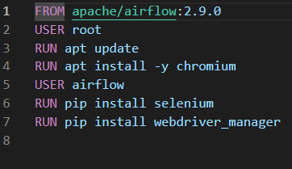

# Orchestrator-Airflow-
## Project brief 
This project aims to help with orchestration for the python scripts, from scheduling, logging and centralizing the python scripts in one place instead of being them scattered all around between servers. Moreover, this documentation aims to introduce Apache airflow solution which is an open-source orchestration tool that has the necessary features that we need to manage the python scripts.
## Airflow architecture 
These links will describe it more: (I have chosen celery executor as it is easier to start with than kubernetes)
1. https://www.accionlabs.com/how-to-setup-airflow-multinode-cluster-with-celery-rabbitmq
2. https://medium.com/accredian/executors-in-apache-airflow-148fadee4992
3. https://www.youtube.com/watch?v=lVS6lz5wuH4&list=PL5SUlZie0EZYcqBfbeKULi5eLQ-t-LymR&ab_channel=BryanCafferky
4. https://www.youtube.com/watch?v=3nhsEcBHz4Y&list=PL5SUlZie0EZYcqBfbeKULi5eLQ-t-LymR&index=2&ab_channel=DatawithMarc
5. https://www.youtube.com/watch?v=NQ3fZtyXji0&list=PL5SUlZie0EZYcqBfbeKULi5eLQ-t-LymR&index=3&ab_channel=Fireship
6. https://www.youtube.com/watch?v=TzVkED3y3Ig&list=PL5SUlZie0EZYcqBfbeKULi5eLQ-t-LymR&index=5&ab_channel=SKonik
## Installion steps
### Main node (Docker)
> [!NOTE]
> Make you have installed docker on the master node which sould be a linux OS. https://docs.docker.com/desktop/install/rhel/

first step is to make sure that you are in the airflow-docker folder then go the cmd and run these commands


Under the User Airflow section line put the necessary packages to install
> [!NOTE]
> Every time you need to install new packages you need to rebuild the image.

```
docker-compose build
```

```
docker-compose up
```
> [!NOTE]
> It will take time to start up and build the image it can take a few minutes.

then enter this in the browser to access the web UI:

```
http://localhost:8080/
```

