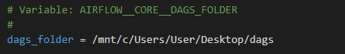
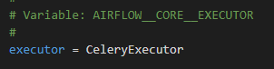
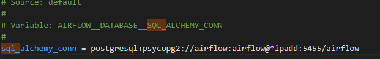
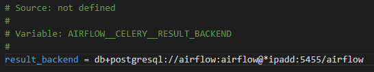
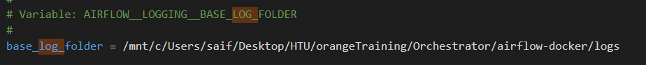

# Orchestrator-Airflow-
## Project Brief 
This project aims to help with orchestration for the Python scripts, from scheduling, logging and centralizing the Python scripts in one place instead of being them scattered all around between servers. Moreover, this documentation aims to introduce the Apache airflow solution which is an open-source orchestration tool that has the necessary features that we need to manage the Python scripts.
## Airflow architecture 
These links will describe it more: (I have chosen celery executor as it is easier to start with than Kubernetes)
1. https://www.accionlabs.com/how-to-setup-airflow-multinode-cluster-with-celery-rabbitmq
2. https://medium.com/accredian/executors-in-apache-airflow-148fadee4992
3. https://www.youtube.com/watch?v=lVS6lz5wuH4&list=PL5SUlZie0EZYcqBfbeKULi5eLQ-t-LymR&ab_channel=BryanCafferky
4. https://www.youtube.com/watch?v=3nhsEcBHz4Y&list=PL5SUlZie0EZYcqBfbeKULi5eLQ-t-LymR&index=2&ab_channel=DatawithMarc
5. https://www.youtube.com/watch?v=NQ3fZtyXji0&list=PL5SUlZie0EZYcqBfbeKULi5eLQ-t-LymR&index=3&ab_channel=Fireship
6. https://www.youtube.com/watch?v=TzVkED3y3Ig&list=PL5SUlZie0EZYcqBfbeKULi5eLQ-t-LymR&index=5&ab_channel=SKonik
## Installation steps
### Main node (Docker)
> [!NOTE]
> Make sure you have installed docker on the master node which should be a Linux OS. https://docs.docker.com/desktop/install/rhel/

The first step is to make sure that you are in the airflow-docker folder then go to the cmd and run these commands


1. Under the User Airflow section line put the necessary packages to install
2. To change the version of running airflow just replace the 'FROM apache/airflow:2.9.0' with 'FROM apache/airflow: the version number you want to change'


If you want to change the directory of the DAG folder, under the environment section in the docker-compose file, use this environment variable with the shared folder path:

```
AIRFLOW__CORE__DAGS_FOLDER:
```

> [!NOTE]
> Every time you need to install new packages you need to rebuild the image.

```
docker-compose build
```

```
docker-compose up
```
> [!NOTE]
> It will take time to start up and build the image it can take a few minutes.

then enter this in the browser to access the web UI:

```
http://localhost:8080/
```

It will open up this page and ask for a username and a password

```
airflow
```
```
airflow
```


these videos will take you through the UI:
1. https://www.youtube.com/watch?v=GrEskQFqQE0&list=PL5SUlZie0EZYcqBfbeKULi5eLQ-t-LymR&index=4
2. https://youtu.be/0zwbhmXHe78?si=GTET3E3oXZqQ4BSb&t=519 (for new changes in the 2.9 version which the installed version is for.)

### Workers Node (WSL)

> [!NOTE]
> WSL (Windows Subsystem for Linux) is supported for Windows Server 2019 and above only.

I used this link to guide me to install it: https://learn.microsoft.com/en-us/windows/wsl/install-on-server

The steps to download WSL on a Windows Server (make sure you open PowerShell as an admin):

```
Enable-WindowsOptionalFeature -Online -FeatureName Microsoft-Windows-Subsystem-Linux
```
It will ask you to restart the server afterwards.

The second step is to download the Ubuntu distribution using this command:
```
curl.exe -L -o Ubuntu.appx https://aka.ms/wslubuntu2004
```
Then we need to extract it using these commands:
```
Rename-Item .\Ubuntu.appx .\Ubuntu.zip
Expand-Archive .\Ubuntu.zip .\Ubuntu
```
change directories by using the (CD) command to the downloaded distribution folder and enter these commands:
```
Add-AppxPackage .\app_name.appx
```
Then add it to the environment variables:
```
$userenv = [System.Environment]::GetEnvironmentVariable("Path", "User")
[System.Environment]::SetEnvironmentVariable("PATH", $userenv + ";C:\Users\Administrator\Ubuntu", "User")
```

After installing WSL enter this command to launch Ubuntu:
```
Ubuntu.exe
```
or
```
WSL
```
After launching the WSL we need to check for PIP if it is installed:
```
pip --version
```
If not, run this command to install it:
```
sudo apt install python3-pip
```

Then install all the Python packages you want to work on (I recommend putting them in a requirements file easier to track them and install them across all of the workers)
To start installing airflow on the workers run this command: 
```
pip install apache-airflow[celery]
```

Install the Postgres adapter
```
pip install psycopg2-binary
```

Change the directory to the home directory using the (CD) command to export the config file:
```
airflow config list -d -V -e -s > "airflow.cfg"
```

Apply these changes to the config file (If you have VScode press ctrl+f to find them easier):



The first thing is to modify the path of the DAG folder to be shared with the master and the WSL is in the “mnt” folder as shown in the above picture. 



Then I changed the executor to the celery executor as shown in the above picture. This is the executor we need. 



Then I changed the DAG metadata database to point to the masters’ one as shown in the above picture.


Then changed the message broker to point to the masters’ one as shown in the above picture.



Then the metadata for the message broker points to the masters’ one as shown in the above picture.



Then modify the path of the Log folder to be shared with the master and the WSL is in the “mnt” folder as shown in the above picture. 

> [!NOTE]
> Make sure you have saved all of the changes.

Type this command to start the metadata database:
```
airflow db migrate
```

> [!NOTE]
> After any change in the config you need to restart the metadata database.

to start the workers (change the name of queue saif to something unique):
```
airflow celery worker -q saif
```
to add multiple queues:
```
airflow celery worker -q saif, maher, ahmed
```

## additional information

https://youtube.com/playlist?list=PL5SUlZie0EZYcqBfbeKULi5eLQ-t-LymR&si=7MxL8RgTlTmOShkk

This is a playlist where all of the videos that you need to understand more about airflow.

https://www.linkedin.com/in/marclamberti/

this is a LinkedIn profile of a person who posts tips and any new changes coming to airflow in the future.
