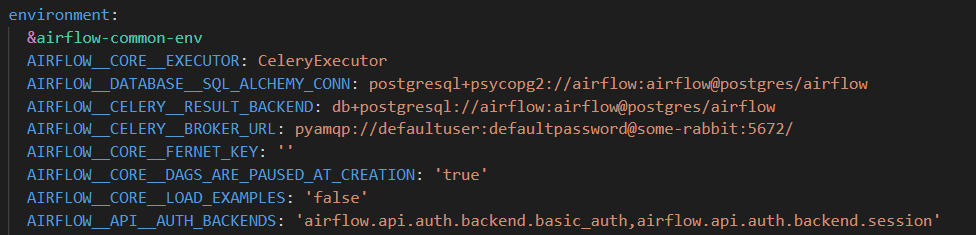

# Orchestrator-Airflow-
## Project Brief 
This project aims to help with orchestration for the Python scripts, from scheduling, logging and centralizing the Python scripts in one place instead of being them scattered all around between servers. Moreover, this documentation aims to introduce the Apache airflow solution which is an open-source orchestration tool that has the necessary features that we need to manage the Python scripts.
## Airflow architecture 
These links will describe it more: (I have chosen celery executor as it is easier to start with than Kubernetes)
1. https://www.accionlabs.com/how-to-setup-airflow-multinode-cluster-with-celery-rabbitmq
2. https://medium.com/accredian/executors-in-apache-airflow-148fadee4992
3. https://www.youtube.com/watch?v=lVS6lz5wuH4&list=PL5SUlZie0EZYcqBfbeKULi5eLQ-t-LymR&ab_channel=BryanCafferky
4. https://www.youtube.com/watch?v=3nhsEcBHz4Y&list=PL5SUlZie0EZYcqBfbeKULi5eLQ-t-LymR&index=2&ab_channel=DatawithMarc
5. https://www.youtube.com/watch?v=NQ3fZtyXji0&list=PL5SUlZie0EZYcqBfbeKULi5eLQ-t-LymR&index=3&ab_channel=Fireship
6. https://www.youtube.com/watch?v=TzVkED3y3Ig&list=PL5SUlZie0EZYcqBfbeKULi5eLQ-t-LymR&index=5&ab_channel=SKonik
## Installation steps
### Main node (Docker)
> [!NOTE]
> Make sure you have installed docker on the master node which should be a Linux OS. https://docs.docker.com/desktop/install/rhel/

The first step is to make sure that you are in the airflow-docker folder then go to the cmd and run these commands


1. Under the User Airflow section line put the necessary packages to install
2. To change the version of running airflow just replace the 'FROM apache/airflow:2.9.0' with 'FROM apache/airflow: the version number you want to change'



If you want to change the directory of the DAG folder, under the environment section in the docker-compose file, use this environment variable with the shared folder path:

```
AIRFLOW__CORE__DAGS_FOLDER:
```

> [!NOTE]
> Every time you need to install new packages you need to rebuild the image.

```
docker-compose build
```

```
docker-compose up
```
> [!NOTE]
> It will take time to start up and build the image it can take a few minutes.

then enter this in the browser to access the web UI:

```
http://localhost:8080/
```

It will open up this page and ask for a username and a password

```
airflow
```
```
airflow
```


these videos will take you through the UI:
1. https://www.youtube.com/watch?v=GrEskQFqQE0&list=PL5SUlZie0EZYcqBfbeKULi5eLQ-t-LymR&index=4
2. https://youtu.be/0zwbhmXHe78?si=GTET3E3oXZqQ4BSb&t=519 (for new changes in the 2.9 version which the installed version is for.)
